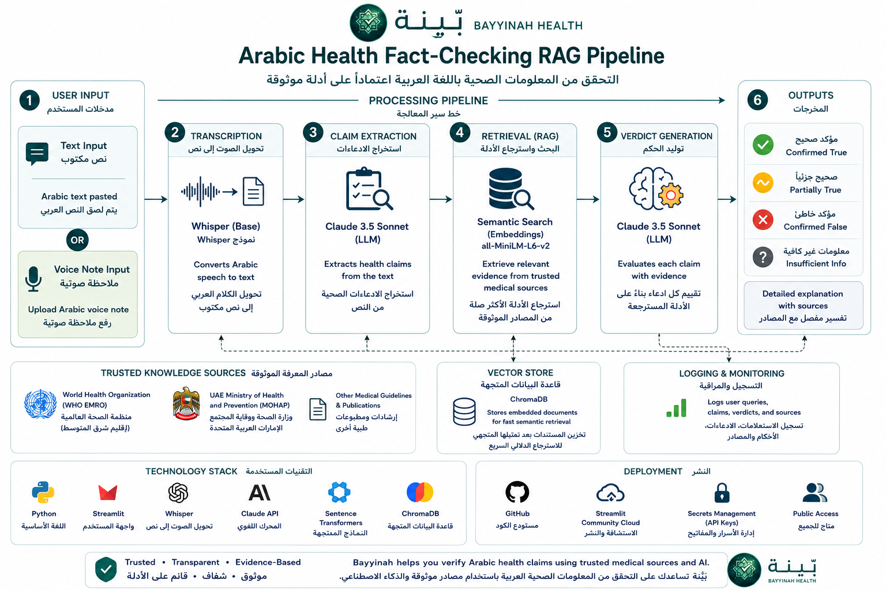

# 🩺 بَيِّنة (Bayyinah Health)

**An AI-powered Arabic Health Literacy Checker that verifies health claims using Retrieval-Augmented Generation (RAG) grounded in trusted medical evidence.**

Bayyinah helps users verify Arabic health information—whether written text or voice notes—against trusted sources such as **WHO EMRO** and the **UAE Ministry of Health and Prevention (MOHAP)**.

The system is designed to help address health misinformation in Arabic-speaking communities by providing transparent, evidence-grounded explanations rather than unsupported AI-generated answers.

> 🌐 **Live Demo:** [Launch Bayyinah Health](https://arabic-health-checker-c9c6j9j9fbgpavhwuk3dg5.streamlit.app/)

---

## Why Bayyinah?

Health misinformation can spread rapidly across social media and messaging platforms, particularly through **forwarded messages and voice notes**.

While many fact-checking tools primarily focus on English text, fewer systems are designed specifically for **Arabic health information**, and fewer still support spoken Arabic content.

Bayyinah addresses this gap through a **Retrieval-Augmented Generation (RAG)** architecture that combines:

- Arabic text and voice processing
- Health claim extraction
- Semantic evidence retrieval
- Trusted medical references
- Evidence-grounded LLM reasoning
- Explicit uncertainty when sufficient evidence is unavailable

Rather than asking a language model to answer directly from its internal knowledge, Bayyinah first searches its trusted medical knowledge base for relevant evidence and uses that evidence to evaluate each claim.

---

## Features

- ✅ **Arabic text verification**
- 🎙️ **Arabic voice-note verification** using Whisper
- 🔍 **Multi-claim extraction** from a single message
- 🧠 **Semantic search** using multilingual sentence embeddings
- 📚 **Evidence retrieval** from trusted WHO EMRO and UAE MOHAP documents
- ⚖️ **Evidence-grounded verdict generation** using Claude
- 🚦 **Risk-level assessment** — Low, Medium, or High
- 📖 **Transparent explanations** with supporting medical sources
- ❓ **Honest uncertainty** — returns *"معلومات غير كافية"* when the available evidence is insufficient instead of guessing
- 🌐 **Public web interface** built with Streamlit

---

## System Architecture

<p align="center">
  
</p>

<p align="center">
  <em>
    End-to-end architecture of Bayyinah Health, from Arabic text or voice input
    to evidence-grounded health claim verification.
  </em>
</p>

Bayyinah follows a **retrieval-first RAG architecture**:

**Arabic Text / Voice Note → Speech Transcription → Claim Extraction → Semantic Retrieval → Evidence-Grounded Verdict**

### 1. User Input

Users can submit either:

- Arabic text
- An Arabic voice note

### 2. Speech Transcription

For voice input, **OpenAI Whisper** converts the Arabic audio into text.

Text input bypasses this stage and proceeds directly to claim extraction.

### 3. Claim Extraction

The Arabic content is analyzed by **Claude**, which separates the message into individual factual health claims.

This allows Bayyinah to evaluate multiple claims independently rather than assigning one verdict to an entire message.

### 4. Evidence Retrieval

Each extracted claim is transformed into a multilingual sentence embedding using:

`paraphrase-multilingual-MiniLM-L12-v2`

The embedding is compared against medical documents stored in **ChromaDB**, allowing the system to retrieve the most semantically relevant evidence from the trusted knowledge base.

### 5. Verdict Generation

The claim and retrieved medical evidence are provided to **Claude**.

The model is instructed to evaluate the claim using only evidence that is genuinely relevant to the claim.

### 6. Output

For each health claim, Bayyinah returns:

- **Verdict**
  - مؤكد صحيح — Confirmed True
  - مؤكد خاطئ — Confirmed False
  - صحيح جزئيًا — Partially True
  - معلومات غير كافية — Insufficient Information
- **Explanation**
- **Risk level**
- **Supporting medical sources**, when relevant evidence is available

The pipeline deliberately follows a conservative approach.

If sufficiently relevant evidence cannot be retrieved, Bayyinah reports:

> **معلومات غير كافية** *(Insufficient Information)*

rather than forcing an unsupported conclusion or citation.

---

## Technology Stack

| Component | Technology |
| --- | --- |
| Programming Language | Python |
| User Interface | Streamlit |
| Large Language Model | Claude — Anthropic API |
| Speech Recognition | OpenAI Whisper |
| Embeddings | `paraphrase-multilingual-MiniLM-L12-v2` |
| Embedding Library | Sentence Transformers |
| Vector Database | ChromaDB |
| Retrieval Method | Retrieval-Augmented Generation (RAG) |
| Deployment | Streamlit Community Cloud |
| Version Control | Git / GitHub |

---

## Project Structure

```text
Arabic-Health-Checker/
│
├── app.py
│   └── Streamlit entry point, navigation, and application setup
│
├── src/
│   ├── build_index.py
│   ├── test_connection.py
│   ├── extract_claims.py
│   ├── retrieve.py
│   ├── generate_verdict.py
│   ├── transcribe.py
│   └── pipeline.py
│
├── views/
│   ├── home.py
│   └── checker.py
│
├── ui/
│   ├── components.py
│   └── styles.py
│
├── assets/
│   ├── bayyinah_logo.png
│   └── Bayyinah_pipeline.png
│
├── data/
│   ├── sources/
│   └── chroma_db/
│
├── .streamlit/
│   └── config.toml
│
├── requirements.txt
├── packages.txt
└── README.md
```

---

## Installation

### 1. Clone the repository

```bash
git clone https://github.com/yourusername/Arabic-Health-Checker.git
cd Arabic-Health-Checker
```

### 2. Create a virtual environment

```bash
python -m venv venv
```

### 3. Activate the environment

**Windows**

```bash
venv\Scripts\activate
```

**Linux / macOS**

```bash
source venv/bin/activate
```

### 4. Install the required Python packages

```bash
pip install -r requirements.txt
```

### 5. Install FFmpeg

Voice-note transcription with Whisper requires **FFmpeg** to be available on the system.

On Ubuntu/Debian:

```bash
sudo apt-get update
sudo apt-get install ffmpeg
```

For Streamlit Community Cloud, the system dependency can be specified in:

```text
packages.txt
```

with:

```text
ffmpeg
```

### 6. Configure the Anthropic API key

Create a `.env` file in the project root:

```text
ANTHROPIC_API_KEY=your_api_key_here
```

Do **not** commit your real API key to GitHub.

When deploying with Streamlit Community Cloud, add the key through the application's **Secrets** settings instead.

### 7. Run the application

```bash
streamlit run app.py
```

The application should then open in your browser.

---

## Current Knowledge Base

The current prototype uses trusted medical documents covering topics including:

- Diabetes
- Cardiovascular diseases
- Cancer
- Asthma
- Influenza
- Nutrition

The knowledge base is built from trusted public health documents, primarily from:

- **World Health Organization — Eastern Mediterranean Regional Office (WHO EMRO)**
- **UAE Ministry of Health and Prevention (MOHAP)**

Additional health topics can be supported by adding trusted documents and rebuilding the ChromaDB vector index.

---

## Retrieval-Augmented Generation

Bayyinah uses **Retrieval-Augmented Generation (RAG)** to reduce reliance on unsupported model knowledge.

For every extracted health claim:

```text
Health Claim
     │
     ▼
Multilingual Embedding
     │
     ▼
ChromaDB Semantic Search
     │
     ▼
Relevant Medical Evidence
     │
     ▼
Evidence + Claim
     │
     ▼
Claude
     │
     ▼
Verdict + Explanation + Risk + Sources
```

The LLM is therefore used primarily for **claim interpretation and evidence-grounded reasoning**, while the factual basis of the verdict comes from retrieved medical documents.

---

## Design Principles

Bayyinah was designed around four core principles:

### 1. Evidence Before Generation

Trusted medical evidence is retrieved before a verdict is generated.

### 2. Conservative Verification

The system should not force a verdict when the available evidence does not sufficiently address the claim.

### 3. Explainability

Users receive more than a True/False label. Each result includes a short explanation describing why the claim received its verdict.

### 4. Transparency

When sufficient evidence is unavailable, Bayyinah explicitly communicates uncertainty instead of presenting unsupported confidence.

---

## Example

A user might submit:

```text
شرب الماء الدافئ على الريق يعالج السكري،
ولقاح الإنفلونزا يسبب الإنفلونزا.
```

Bayyinah first separates this message into individual health claims.

Each claim is then independently searched against the medical knowledge base and assigned its own:

```text
Verdict
Explanation
Risk Level
Supporting Sources
```

This prevents unrelated claims within the same message from being evaluated as a single statement.

---

## Limitations

Bayyinah is currently a prototype and has several important limitations:

- **Whisper transcription quality varies** depending on audio clarity, background noise, speaker speed, and Arabic dialect.
- The current medical knowledge base covers only a **limited set of health topics**.
- Retrieval quality depends on the scope and quality of the indexed documents.
- A missing document in the knowledge base may cause the system to return **Insufficient Information**, even when reliable evidence exists elsewhere.
- LLM-generated explanations may still contain errors despite retrieval grounding.
- Bayyinah currently retrieves evidence from a curated local knowledge base rather than searching the entire medical literature in real time.
- The system has not been clinically validated and should not be used for diagnosis or treatment decisions.

> **Bayyinah is an educational health-information verification tool and does not replace professional medical advice, diagnosis, or treatment.**

---

## Future Work

- [ ] Expand the trusted medical knowledge base
- [ ] Add more WHO EMRO and MOHAP health topics
- [ ] Support additional trusted medical organizations and guidelines
- [ ] Provide direct links to the original WHO/MOHAP evidence pages
- [ ] Improve Arabic dialect speech recognition
- [ ] Add multilingual health-claim verification
- [ ] Evaluate the system using public Arabic misinformation datasets
- [ ] Develop a formal retrieval and verdict accuracy evaluation framework
- [ ] Explore WhatsApp integration for real-world accessibility
- [ ] Improve source-level citation traceability
- [ ] Optimize model loading and memory usage for cloud deployment

---

## Privacy

Bayyinah is designed to minimize unnecessary handling of user information.

The medical knowledge base consists of publicly available health information from trusted organizations.

The application does not intentionally maintain a permanent database of submitted health claims or voice notes.

Temporary audio files used during voice-note processing are removed after transcription and verification.

Users should nevertheless avoid submitting personally identifiable or sensitive medical information when using the public demonstration.

---

## Deployment

Bayyinah is publicly deployed using **Streamlit Community Cloud**.

> 🌐 **Try Bayyinah:** [Launch the live application](https://arabic-health-checker-c9c6j9j9fbgpavhwuk3dg5.streamlit.app/)

The application is connected to the GitHub repository, allowing updates pushed to the repository to be reflected in the deployed application.

API credentials are managed through Streamlit Secrets and are not stored directly in the source code.

---

## License

This project is released under the **MIT License**.

See the `LICENSE` file for details.

---

## Acknowledgements

Bayyinah makes use of technologies and publicly available resources from:

- **World Health Organization — Eastern Mediterranean Regional Office (WHO EMRO)**
- **UAE Ministry of Health and Prevention (MOHAP)**
- **Anthropic Claude API**
- **OpenAI Whisper**
- **Sentence Transformers**
- **ChromaDB**
- **Streamlit**

---

<p align="center">
  
</p>

<p align="center">
  <strong>بَيِّنة — Bayyinah Health</strong><br>
  Trusted • Transparent • Evidence-Based
</p>
